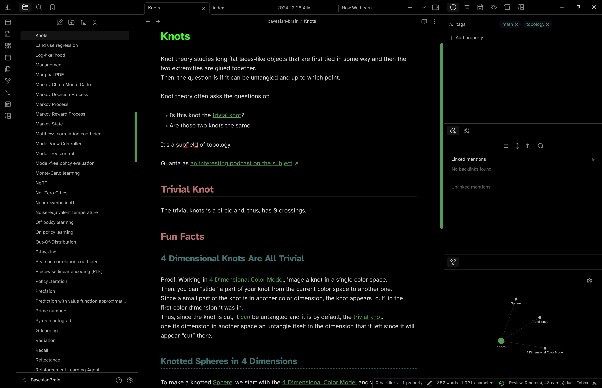

# Emerald Green

> Attention to whoever sees this repo on Github: this is a read-only mirror of the repo on [Codeberg](https://codeberg.org/MalcolmMielle/Emerald-Echo) and contributions should be submitted there.

A green theme for obsidian inspired by [Green Nightmare](https://github.com/prradox/green-nightmare) and my own OneDarkPro Retro green theme for VSCode.

## Objectives of this theme

* Clear coloring difference between bold, italics, highlight, link in the obsidian, and external links
* High contrast without being neon (appart from the H1 title)
  * Since the H1 title is made to pop out, the theme is tailored for notes with a H1 title on top and no inline title using the note name; like in the screenshot.
* Visually be able to distinguish the title levels without having to read them:
  * Different colors
  * Different underline styles
* Dark and light theme
* Mobile friendly
* A bit of a hacker feel with a terminal green look
